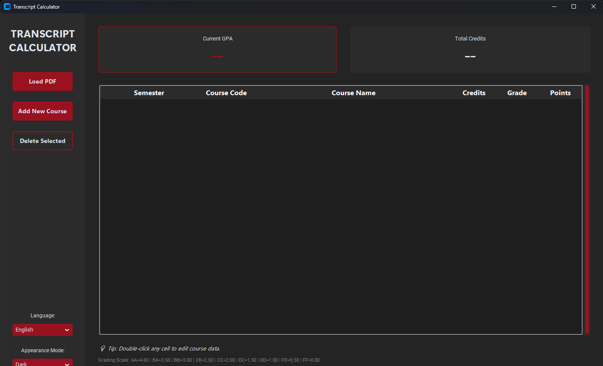

# Transcript Calculator for Izmir Institute of Technology (IZTECH)

[English](#english) | [Türkçe](#türkçe)

---

## Türkçe

İzmir Yüksek Teknoloji Enstitüsü (İYTE) için PDF transkriptlerini otomatik olarak ayrıştıran ve GNO (Genel Not Ortalaması) hesaplayan bir masaüstü uygulaması.

### Hızlı Başlangıç (Windows)
Python kurulumuyla uğraşmak istemiyorsanız, [Releases](https://github.com/YOUR_USERNAME/transcript-calculator/releases) sayfasından son sürüm `.exe` dosyasını indirip kullanmaya başlayabilirsiniz.

### Kurulum

1. Bu depoyu klonlayın:
   ```bash
   git clone https://github.com/YOUR_USERNAME/transcript-calculator.git
   ```
2. Proje dizinine gidin:
   ```bash
   cd transcript-calculator
   ```
3. Gerekli kütüphaneleri yükleyin:
   ```bash
   pip install -r requirements.txt
   ```
4. Uygulamayı çalıştırın:
   ```bash
   python transcript_calculator.py
   ```

### Kullanım

1. UBYS üzerinden transkriptinizi PDF olarak indirin.
2. UBYS Transkript sayfasında "Yazdır" butonuna tıklayıp, çıkan dokümanı PDF olarak kaydedin.
3. Uygulamayı açın ve "Load PDF" butonuna tıklayın.
4. İndirdiğiniz PDF dosyasını seçin.

- Hücrelere **çift tıklayarak** değerleri (not, kredi vb.) düzenleyebilirsiniz.
- Silmek istediğiniz dersi seçip "Delete Selected" butonuna basarak silebilirsiniz.
- "Add New Course" butonu ile listede olmayan yeni dersler ekleyebilirsiniz.

---

## English

A modern desktop application designed to parse PDF transcripts and calculate GPA automatically for IZTECH students. Built with Python and CustomTkinter.

### Quick Start (Windows)
If you prefer not to use Python, you can download the latest standalone `.exe` file from the [Releases](https://github.com/YOUR_USERNAME/transcript-calculator/releases) page and run it immediately.

### Installation

1. Clone this repository:
   ```bash
   git clone https://github.com/YOUR_USERNAME/transcript-calculator.git
   ```
2. Navigate to the project directory:
   ```bash
   cd transcript-calculator
   ```
3. Install the required dependencies:
   ```bash
   pip install -r requirements.txt
   ```
4. Run the application:
   ```bash
   python transcript_calculator.py
   ```

### Usage

1. Download your transcript PDF from UBYS.
2. On the UBYS Transcript page, click "Print" and save the document as a PDF.
3. Open the application and click the "Load PDF" button.
4. Select the downloaded PDF file.

- You can **edit values** by double-clicking any cell.
- You can **delete courses** by selecting them and clicking the "Delete Selected" button.
- You can **add new courses** by clicking the "Add New Course" button.

### Preview


